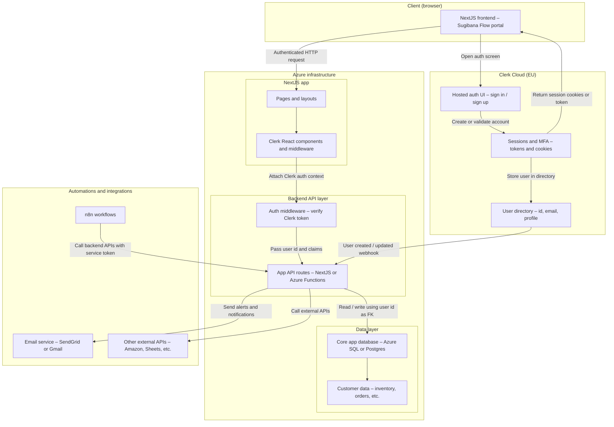

```mermaid
flowchart TB
  %% LAYOUT: TOP → BOTTOM

  subgraph Client["Client (browser)"]
    B["NextJS frontend – Sugibana Flow portal"]
  end

  subgraph Auth["Clerk Cloud (EU)"]
    C1["Hosted auth UI – sign in / sign up"]
    C2["Sessions and MFA – tokens and cookies"]
    C3["User directory – id, email, profile"]
  end

  subgraph Azure["Azure infrastructure"]
    subgraph WebApp["NextJS app"]
      F1["Pages and layouts"]
      F2["Clerk React components and middleware"]
    end

    subgraph Backend["Backend API layer"]
      A2["Auth middleware – verify Clerk token"]
      A1["App API routes – NextJS or Azure Functions"]
    end

    subgraph Data["Data layer"]
      D1["Core app database – Azure SQL or Postgres"]
      D2["Customer data – inventory, orders, etc."]
    end
  end

  subgraph Automations["Automations and integrations"]
    N1["n8n workflows"]
    S1["Email service – SendGrid or Gmail"]
    P1["Other external APIs – Amazon, Sheets, etc."]
  end

  %% AUTH FLOW
  B -->|"Open auth screen"| C1
  C1 -->|"Create or validate account"| C2
  C2 -->|"Return session cookies or token"| B
  C2 -->|"Store user in directory"| C3

  %% APP FLOW (CLIENT → WEBAPP → BACKEND)
  B -->|"Authenticated HTTP request"| F1
  F1 --> F2
  F2 -->|"Attach Clerk auth context"| A2
  A2 -->|"Pass user id and claims"| A1

  %% DATA ACCESS
  A1 -->|"Read / write using user id as FK"| D1
  D1 --> D2

  %% CLERK WEBHOOKS
  C3 -->|"User created / updated webhook"| A1

  %% AUTOMATIONS / INTEGRATIONS
  N1 -->|"Call backend APIs with service token"| A1
  A1 -->|"Send alerts and notifications"| S1
  A1 -->|"Call external APIs"| P1
```
